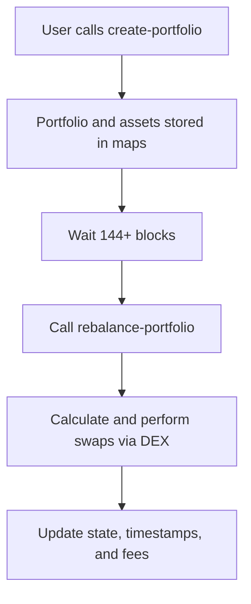

# 📊 Bitcoin Portfolio Manager (BPM)

**BPM** is a decentralized protocol for managing multi-asset portfolios on the **Stacks blockchain**, enabling non-custodial, automated, and Bitcoin-secured portfolio rebalancing using SIP-010 tokens.

## 🧭 Overview

BPM allows users to create tokenized investment portfolios with customizable asset allocations and automated rebalancing logic. It leverages Stacks smart contracts to ensure transparency, security, and Bitcoin finality.

## 🚀 Features

* 🔗 **Bitcoin-Layer Security** — Built on Stacks for Bitcoin anchoring and finality.
* 📦 **Multi-Asset Portfolios** — Support for up to 10 SIP-010-compatible tokens.
* 🔄 **Automated Rebalancing** — Adjusts portfolio balances every 144 blocks (\~24 hours).
* 🔐 **Non-Custodial Ownership** — Users retain full control of their portfolios.
* 💸 **Transparent Fees** — 0.25% protocol fee on rebalancing operations.
* 🧩 **Composable Architecture** — Interoperable with DeFi protocols and DEXs.

## 🧱 Architecture

### 🔹 Core Components

* **Portfolio Registry (`Portfolios` map)**
  Stores portfolio metadata: ownership, timestamps, token count, etc.

* **Asset Allocations (`PortfolioAssets` map)**
  Tracks per-portfolio token composition: target percentage, amount, address.

* **User Mapping (`UserPortfolios` map)**
  Associates users with the portfolio IDs they own.

### 🔸 Example Data Structures

```clarity
(define-map Portfolios
  uint
  {
    owner: principal,
    created-at: uint,
    last-rebalanced: uint,
    total-value: uint,
    active: bool,
    token-count: uint,
  }
)

(define-map PortfolioAssets
  {
    portfolio-id: uint,
    token-id: uint,
  }
  {
    target-percentage: uint,
    current-amount: uint,
    token-address: principal,
  }
)
```

---

## ⚙️ Key Functions

| Function                      | Type      | Description                                                   |
| ----------------------------- | --------- | ------------------------------------------------------------- |
| `create-portfolio`            | Public    | Initializes a new portfolio with tokens and target weights.   |
| `rebalance-portfolio`         | Public    | Rebalances assets based on deviation from target allocations. |
| `update-portfolio-allocation` | Public    | Updates target weight for a specific asset.                   |
| `get-portfolio`               | Read-only | Fetches metadata for a given portfolio.                       |
| `get-portfolio-asset`         | Read-only | Returns allocation details for a portfolio asset.             |
| `get-user-portfolios`         | Read-only | Lists all portfolios created by a user.                       |

---

## 🧠 Design Considerations

* **Security First**
  Only the portfolio creator can execute updates or rebalances.

  ```clarity
  (asserts! (is-eq tx-sender (get owner portfolio)) ERR-NOT-AUTHORIZED)
  ```

* **Mathematical Precision**
  Allocation values validated using basis points:

  ```clarity
  (define-private (validate-percentage (percentage uint))
    (and (>= percentage u0) (<= percentage BASIS-POINTS)))
  ```

* **Immutable Deployment**
  Contracts are non-upgradable with frozen ownership post-deployment.

---

## 🔄 Rebalancing Workflow



---

## 🧪 Example Usage

```clarity
;; Create Portfolio
(create-portfolio
  (list 'STX.tokenA 'STX.tokenB)
  (list u6000 u4000) ;; 60% / 40%
)

;; Rebalance Portfolio
(rebalance-portfolio u1)

;; Update Target Allocation
(update-portfolio-allocation u1 u0 u5000)
```

## 📚 Constants & Codes

* `MAX-TOKENS-PER-PORTFOLIO = 10`
* `BASIS-POINTS = 10000`
* `REBALANCE-INTERVAL = 144 blocks`
* `PROTOCOL-FEE = 25` (0.25%)

| Code   | Meaning                |
| ------ | ---------------------- |
| `u100` | ERR-NOT-AUTHORIZED     |
| `u106` | ERR-INVALID-PERCENTAGE |

## 🔮 Roadmap

* 🔄 Cross-chain rebalancing via **sBTC**
* 📊 Portfolio performance analytics
* 🌉 Liquidity provider integrations
* 🛡️ Insurance vaults for slippage protection
* 🗳️ Governance for protocol configuration

## 📦 Requirements

* **Stacks 2.1+**
* **SIP-010** tokens
* **Clarinet** for development and testing

## 🤝 Contributing

1. Fork & clone the repo
2. Install Clarinet
3. Run tests
4. Submit PR with signed commits
